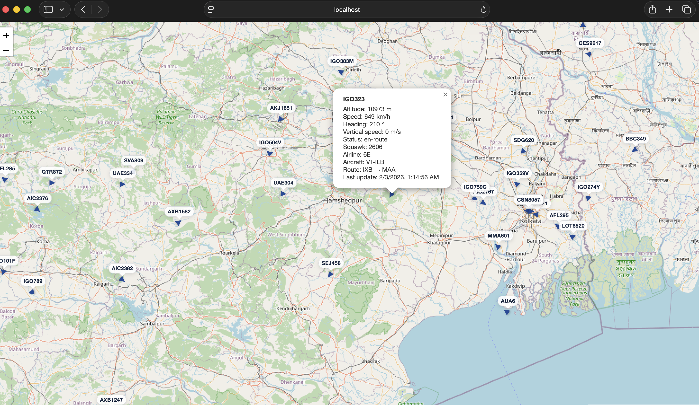

# Flight Tracker



_Live flight map with a selected route and detailed aircraft panel._

A real-time web application that displays live aircraft positions on an interactive map. View flights, select them to see details, and track their routes.

## Features

- **Live Flight Visualization**: Real-time aircraft positions with animated markers showing heading/direction
- **Viewport-based Filtering**: Only fetches and displays flights within the current map viewport for performance
- **Flight Selection**: Click on any flight to view detailed information including altitude, speed, heading, airline, aircraft, and route
- **Flight Path Display**: View the flight path as a polyline on the map when a flight is selected
- **Multiple Data Providers**: Supports OpenSky Network (free) and Aviation Edge (API key required)
- **International Date Line Support**: Correctly displays flights when panning across the date line

## Tech Stack

- **Frontend**: React 18 + TypeScript + Vite
- **Backend**: Express.js (API proxy for secure key handling)
- **Mapping**: Leaflet + React-Leaflet + OpenStreetMap tiles
- **Testing**: Vitest + React Testing Library + MSW (unit tests), Playwright (e2e)

## Getting Started

### Prerequisites

- Node.js 18+
- npm

### Installation

```bash
git clone https://github.com/yourusername/flight-tracker.git
cd flight-tracker
npm install
```

### Running the App

```bash
npm run dev
```

This starts both the Express backend (port 3001) and Vite dev server concurrently. On startup, the dev server prompts you to select a flight data provider. Providers are defined in `config/providers.json`. The selected provider is written to `public/runtime-provider.json`.

### Provider Configuration

#### OpenSky Network (Default)
No API key required. Free tier with rate limits.

#### Aviation Edge
Requires an API key. Set `AVIATION_EDGE_API_KEY` in your environment or `.env.local`:

```bash
cp .env.example .env.local
# Edit .env.local and add your API key
```

The API key is kept server-side only and never exposed to the browser. Get your API key at [aviation-edge.com](https://aviation-edge.com/)

### Production Build

```bash
# Build client and server
npm run build
npm run build:server

# Start production server
AVIATION_EDGE_API_KEY=your_key npm start
```

The Express server serves the static frontend from `dist/` and handles API proxying on a single port.

## Production Deployment with a Domain

### Using a Reverse Proxy (Recommended)

1. **Build and start the app**:
   ```bash
   npm run build && npm run build:server
   AVIATION_EDGE_API_KEY=your_key npm start
   ```
   The server listens on port 3001 by default (configurable via `PORT` env var).

2. **Set up nginx as a reverse proxy**:
   ```nginx
   server {
       listen 80;
       server_name flights.yourdomain.com;

       location / {
           proxy_pass http://127.0.0.1:3001;
           proxy_http_version 1.1;
           proxy_set_header Host $host;
           proxy_set_header X-Real-IP $remote_addr;
           proxy_set_header X-Forwarded-For $proxy_add_x_forwarded_for;
           proxy_set_header X-Forwarded-Proto $scheme;
       }
   }
   ```

3. **Enable HTTPS with Let's Encrypt**:
   ```bash
   sudo certbot --nginx -d flights.yourdomain.com
   ```

4. **Keep the server running** with a process manager:
   ```bash
   # Using PM2
   npm install -g pm2
   PORT=3001 AVIATION_EDGE_API_KEY=your_key pm2 start dist-server/index.js --name flight-tracker
   pm2 save
   pm2 startup
   ```

### Using Docker

Create a `Dockerfile`:
```dockerfile
FROM node:18-alpine
WORKDIR /app
COPY package*.json ./
RUN npm ci --only=production
COPY dist/ ./dist/
COPY dist-server/ ./dist-server/
EXPOSE 3001
CMD ["node", "dist-server/index.js"]
```

Build and run:
```bash
npm run build && npm run build:server
docker build -t flight-tracker .
docker run -d -p 3001:3001 -e AVIATION_EDGE_API_KEY=your_key flight-tracker
```

### Cloud Platforms

The app works with any platform that supports Node.js:

- **Railway/Render/Fly.io**: Connect your repo and set `AVIATION_EDGE_API_KEY` in environment variables. The build commands are already defined in `package.json`.
- **AWS/GCP/Azure**: Deploy the Docker image or use their Node.js runtime with the production build.

## Testing

```bash
# Run unit tests in watch mode
npm test

# Run unit tests once
npm run test:run

# Run e2e tests
npm run test:e2e
```

## Project Structure

```
flight-tracker/
├── src/
│   ├── components/       # React components
│   │   ├── FlightDetailsPanel.tsx # Selected flight info panel
│   │   ├── MapView.tsx            # Main map and flight rendering
│   │   └── ViewportObserver.tsx   # Map viewport change detection
│   ├── lib/              # Utilities, hooks, and API clients
│   │   ├── aviationEdge.ts        # Aviation Edge API client
│   │   ├── bbox.ts                # Bounding box utilities
│   │   ├── filter.ts              # Flight filtering logic
│   │   ├── flightProviders.ts     # Provider factory
│   │   ├── marker.ts              # Map marker utilities
│   │   ├── mockFlightDetailsProvider.ts # Mock provider for testing
│   │   ├── opensky.ts             # OpenSky Network API client
│   │   ├── providerConfig.ts      # Provider configuration loader
│   │   ├── providers.ts           # Provider type definitions
│   │   ├── runtimeConfig.ts       # Runtime config utilities
│   │   ├── types.ts               # TypeScript interfaces
│   │   ├── useFlightDetails.ts    # Flight details hook
│   │   └── useFlights.ts          # Flight data fetching hook
│   ├── test/             # Test setup (MSW handlers, setupTests)
│   └── __tests__/        # Integration tests
├── server/               # Express backend
│   ├── index.ts                   # Server entry point
│   ├── proxy.ts                   # API proxy routes
│   └── vitest.config.ts           # Server test config
├── e2e/                  # Playwright e2e tests
├── config/               # Provider configuration
└── public/               # Static assets
```

## Attribution

- Map tiles: [OpenStreetMap](https://www.openstreetmap.org/copyright) contributors
- Flight data: [OpenSky Network](https://opensky-network.org/) / [Aviation Edge](https://aviation-edge.com/)

## License

MIT
